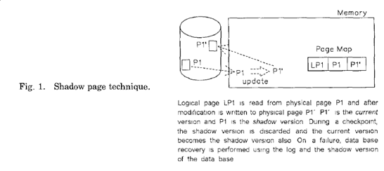

## Aries:A Transcation Recovery Method Supporting Fine-Granularity Locking and Partial Rollbacks Using Write-Ahead Logging ##
# Aries协议：一种支持低颗粒度锁和采用日志先行策略的局部回滚的恢复机制 #

在本文中，我们提出一种简单而高效的恢复机制，称之为ARIES（Algorithm for Recovery and Isolation Exploiting Semantics）。它支持局部事务回滚，低颗粒度（比如记录级）锁，以及使用日志先行（WAL）策略的恢复机制。我们采用这样一种理论：当系统down掉后，在回滚失败的事务之前，回溯历史记录并重做所有丢失的更新。ARIES在每个页中记录一个日志序列号（LSN）来关联每个页的状态和这个页上的操作日志。事务中的所有操作都会被写入日志（包括那些在回滚流程中的操作）。当以一种适当的方式将回滚中的日志记录和之前的日志记录串连起来，我们就可以在有限的步骤中进行回滚操作，甚至在一些极端情况（重启过程中的重复错误、嵌套回滚）也能够很好工作。我们将会讨论一系列的在工业等级的事务系统中的所需要注意的方面。ARIES支持模糊检测点，选择性和延迟性的重启，模糊镜像备份，从物理介质恢复，高并发锁模型（比如,增加、减少），因此我们提出一些语义上的操作，并且要求能够记录日志。ARIES可以灵活支持多种缓存管理策略，并且可以支持变长对象。“重启并发”，“面向页的重做”以及“逻辑重做”这保证了它的并发性和性能。我们将会讨论为什么R系统的日志恢复模型（基于影子页技术）需要在WAL阶段进行修改。我们将会对比ARIES和DB2，IMS，Tandem 系统上的基于WAL的恢复模型。ARIES不仅仅使用与数据库管理系统，同样适用于面向对象语言的持久化，文件系统恢复和事务操作系统。AIRES已经在很多系统上得以实现：IBM的OS/2 进阶版数据库管理系统，DB2，Workstation Data Save Facility/VM,Starburst and QuickSilver 以及在威斯康星州大学的EXODUS和Gamma数据库管理系统。

1、介绍

在这一章节中，我们首先介绍一些关于恢复、并发、缓存管理的概念，然后概述一下本片论文的其余部分。

1.1 日志、失效、恢复机制

事务的概念已经耳熟能详，它囊括了ACID（原子性，一致性，独立性，持久性）四种属性[36]。这种事务理念的应用并不局限在数据库领域。在事务执行过程中，面临多重事务并发执行以及各种失效情况，保证其原子性和持久性是一大难点。之前，人们提出很多方法来解决这个问题，但是这些方法的假设前提、性能特性、复杂度以及adhoc特性并不能令人满意。对于这个问题的解决方案通常会从几个方面进行度量：

1. 页面内和跨页下的并发度支持，
1. 生成结果的逻辑复杂度，
1. 在重启恢复以及正常运行时对于同步和异步IO的负载，
1. 多样化的功能支持（局部事务回滚等等），
1. 重启恢复时所需要执行的步骤以及并发度，
1. 由死锁、数据存储约束（比如唯一性约束，相对于页的对象大小限制等等）这些系统内部引起的事务回滚，支持特殊的锁模型（支持并发执行），
1. 对于不同事务对于同一数据的操作（符合交互性以及一些其他属性的操作，比如+、-），等等诸如此类。
	
本文中，我们将介绍一种新的恢复机制：ARIES（译者评：真是犹抱琵琶半遮面阿），它在上述的各种度量下都能表现的很好。它也提供了一些弹性策略，让一些应用可以利用自身的特性来提升性能（比如IMS Fast Path支持的这类程序）。
	
为了保证事务性和数据恢复，ARIES在一个日志中记录了整个事物的步骤以及会影响到数据恢复的操作。因此，通过日志可以保证在各种失效的情况下已经提交的事务仍可以反映到数据库中或者未提交的事务可以回退（比如rolledback）。当数据丢失或者损坏的时候（比如介质恢复），就能从那些包含数据对象内容的日志中重建。概念上来说，日志可以当成是一系列序号增长的文件。在实现的时候，将会使用多个物理文件来简化这种日志归档操作。当记录被追加到这个日志文件时，会给这条记录分配一个唯一的日志序列号（LSN）。LSN是按递增序列分配的。总的来说，LSN是那些日志记录的逻辑地址。有时候，LSN使用版本号或者时间戳。如果多个日志中存储了同一数据的不同片段，那么就需要使用两段式提交协议（比如：目前工业标准Presumed Abort Protocol）。
	
日志的非易失性版本通常被称为持久化存储。持久化存储是指当系统奔溃后仍然存在并且可用的非易失性存储。磁盘就是一种非易失性存储介质，更进一步，人们在不同设备的上维护两份一样的拷贝来提升这种稳定性。我们认为这种存储在线日志的设备是廉价低速的，比如磁带。当生成镜像拷贝的（归档落地）时候，老的归档日志就会被清除，因为在介质恢复的时候并不需要这些日志。
	
当写日志的时候，日志首先会写入这些日志文件的易失性存储（比如，虚拟存储）缓存中。只有在特定的时间（比如提交的时候），在某一点（LSN）之前的日志记录，按照日志页循序写入到固态存储中。这称之为刷出日志到这个LSN。除了由事务或者缓存管理导致日志刷出，会有一个后台进程会定期刷出这些已满的日志缓存。
	
方便起见，我们假设一条操作日志只会存储在一个页中。（这并不是ARIES的必要条件）。实际上，Starburst实现的ARIES中，一条操作记录可能横跨两页日志。一条日志记录中undo（redo也一样）部分提供了事务中undo变更（redo也一样）。同时包含undo和redo信息的日志记录被称作undo-redo 日志记录。有时候，一条日志记录只包含redo或undo信息，这种记录相应的称为redo-only日志记录和undo-only日志记录。根据操作的不同，undo-redo信息中可能记录的是物理记录（比如，在操作前后的对象特定的值），或者是操作记录（比如，对记录15的第3列加5，对记录10的第4列减3）。这种操作型日志利用对数据操作的语义性，因此可以采用高并发锁模型。例如，对于某一种操作，一条记录的同一列可能在很多事务上的有未提交变更，这比在严格并发控制模型（被修改的对象在提交阶段必须先加上X锁）下有更高的并发度。
	
ARIES使用了广为人知的日志先行(WAL)协议。基于WAL的商业原型系统有：（此处省略100字）。在基于WAL系统中，日志页在读写过程中的在非易失性存储上的位置不会发生变更。也就是说在非易失性存储上的变更只是原地变更。继而和影子页技术（R系统和SQL/DS中采用的）的对比，如图1所示：一个页的变更版本会写到另一个(非易失)存储位置。之前的版本用来做数据库恢复时使用（如果系统在下一个检测点之前down掉）。
	
WAL协议假设，根据日志记录的变更数据替换之前的版本之前，这些数据必须已经存在于存储介质上了。也就是说，在将变更的页写回到非易失存储上之前，关于此页上该记录的的undo部分必须首先写到持久化存储上。为了支持协议的这种特性，系统使用恢复机制的WAL方法来存储每个页上的LSN，日志记录的LSN描述了这个页上的最近的操作。读者可以参考[31,97]为什么WAL技术比影子页技术有优势。[16.70]讨论了一种试用独立日志的影子页技术，尽管它避免了一些问题，但是任然有缺陷，并且引入了一些新问题。[82,88]中提出的方法也大体相同。在第十节，我们就会说明在需要高度并发和其他功能时，R系统用影子页技术来做恢复模型，在WAL阶段并不适用。 

（从物理页P1上读出的逻辑页LP1，在变更后写回到物理页P1’，P1’变成当前版本，P1变成影子版本，在检测点后，影子版本会被删掉，当前版本同时变成影子版本。如果系统失效了，数据库会基于影子版本和日志来恢复。）
	
日志中也记录了事务状态，只有当它处于提交状态时，这个事务才算结束。all its log data are safelyrecorded on stable storage by forcing the log up to the transaction’s commit log record’s LSN。这使得恢复程序可以恢复这些已完成的事务，但在系统奔溃前更新页还未落地的。也就是说，只有当这个所有日志记录都写入到持久化存储后，这个事务的提交过程才算结束。
	
我们将讨论三种奔溃情况：事务或进程级，系统级，介质或设备级。如果事务或者进程奔溃了，事务将需要回滚。如果在进程奔溃的时候它正在执行一些操作，那么它很有可能破坏了一些缓冲区中的数据页。如果系统奔溃了，缓存中的数据就会丢失，事务系统就需要使用数据库的持久化存储和日志进行恢复。如果是介质或者设备损坏了，通常这个设备上的数据就丢失了，系统需要从镜像拷贝或者归档中数据和日志进行恢复。
	
Forward processing是指在系统在正常状态下（非重启恢复态），由用户或者其他应用进程触发的数据操作（比如：SQL调用）所导致的数据库事务型操作。也就是说，这类事务并不回滚，也不使用日志来生成（undo）更新操作。Partial rollback是指在事务执行时创建savepoints的能力，并且在savepoint构建之后的这个事务请求回滚。这可以和total rollback对应起来理解，total rollback是将这个事务全部回滚，并且终止事务。不管如何，我们并不深究savepoint概念所涉及到应用层方面，在本篇论文中，我们只讨论数据库恢复技术。Nested rollback(嵌套回滚)是发生在nested rollback is said to have taken place if a partial rollback were to be later followed by a total rollback or another partial rollback whose point of termination is an earlier point in the transaction than the point of termination of the first rollback.Normal undo是指当系统正常运行时，全部或部分的事务回滚。Normal undo可能是由外界请求的回滚操作，或者是由于死锁、错误（比如：违反完整性约束）所引起的系统内部错误。Restart undo指的是当系统奔溃后，在重启恢复阶段的事务回滚。为了更有效率的执行部分和全部回滚，并且使其更利于调试，所有日志记录都按照PrevLSN按照逆序串连起来。也就是说，某个事务最近写的记录会指向其之前的最近写的日志记录（如果有这条记录的话）。在很多基于WAL的系统中，将回滚阶段的使用的日志记录被称为补充日志记录（CLRs）。CLR的操作是否会被回滚，在回滚阶段是否会包含CLR，这取决于特定系统的实现。我们就会看到，在ARIES中，CLR的操作永远不会回退，并且，CLRs是当成redo-only 日志记录。
	
Page-oriented redo is said to occur if the log record whose update is being redone describes which page of the database was originally modified during normal processing and if the same page is modified during the redo processing.重做这些操作时，并不需要知道表或索引的内部定义。也就是说，并不需要检查数据库的其他数据页。这就是和逻辑redo（System R, SQL/DS
and AS/400需要知道索引相关信息）的差别所在。在一些系统中，由于索引的变更日志没有单独存放，而是使用这些数据页的日志记录来redone，因此，如果要执行一次redo操作需要访问多个描述符和数据页。对索引树进行遍历来决定哪些页发生了变更，有时候这些索引页发生变更是因为：这次的redo操作可能和原来在正常流程中变更的索引页不同。面向页的redo使得系统支持对象间的独立恢复。也就是说，一个页的恢复不需要依赖数据库的其他页（数据或者目录）。我们之后会提到，这使得介质恢复异常简单。
	
与此类似，我们可以定义page-oriented undo和logical undo。支持logical undo的系统可以提供更高级别的并行度，相比于只提供page-oriented undo的系统（这是很有可能的）。这是因为前者如果有一个合适的并发控制协议，可以使的一个事务的未提交的操作被另一个事务移到另一个数据页中。如果只能严格执行page-oriented undos,那么后面的事务需要等待前面的事务提交后才能继续操作。Page-oriented redo 和 page-oriented undo由于不需要访问数据库中的页（并不是日志记录中提到的页），这使得在恢复的时候更为快捷。考虑到效率，ARIES支持Page-oriented redo，考虑到高并发，它也支持logical undos.在[62]中，我们介绍了ARIES/IM方法来进行并发控制，B+树索引的恢复，并且通过比较它和其他索引方法在实现logical undos方面的优势。

1.2 闩和锁（Latches and Locks）

通常，人们用latches和locks对共享信息进行访问控制。在一般的文献中，锁讨论的比较多。另一方面，闩的讨论就比较少了。闩类似信号量。通常，闩用来保证物理上的数据一致性，而锁用来保证逻辑上的数据一直性。只有当需要支持多处理器环境时，才需要考虑物理上的数据一致性。闩的持有周期通常比锁的持有周期要短的多。同样，死锁检测也不关注闩等待。Latches are requested in such a manner so as to avoid deadlocks involving latches
alone, or involving latches and locks.
	
占用和释放闩比占有和释放锁要廉价的多。在没有冲突的情况下，如果前者需要10s的指令时间，那么后者就要100s的指令时间。闩的操作如此的廉价是因为闩控制信息通常存储在虚拟缓存的固定位置，并且可以通过闩名直接定位到闩信息。本文之后的协议会讨论到，每个事务顶多会同时获取2到3个闩。因此每个事务在闩请求上阻塞的时间是固定：初始化事务ID等等（仅仅在事务开始的时候）。另一方面，存储上需要动态的去获取，格式化，释放单独的锁。这是显而易见的，因为在大多数系统中，需要锁的对象比需要闩的对象要多上好几个数量级。比如：所有事务需要并发持有或请求的信息都被存储占一个单独的哈希表中。在第一次hash锁名来定位哈希游标的地址（也可能是一串指针）的时候，就能够对于特定锁信息进行寻址定位。通常，在尝试定位锁控制块时，由于可能有多个事务会同时去读取或修改锁表的内容，因此事务会去占有和释放一个或多个闩：hash游标上一个闩，在特定的等待链上可能也有个闩。

锁的获取可能有多种方式，比如：S (Shared), X (exclusive),IX (Intention exclusive), IS (Intention Shared) and SIX (Shared Intention exclusive),也会有不同的颗粒度，比如：记录（元组），表（关系），文件（表空间）。最常见的锁是S、X锁。S锁允许读，X锁允许读写。当锁模式相兼容时，一个对象上的锁可能会同时被不同的事务持有。关于以上锁之间的兼容性如图2所示。打钩表示这两个锁模型间是兼容的。在进行层级加锁时，意向锁（IX，IS，SIX）通常加在较高的层次上（比如：表级别），S和X锁通常加在较低级别（比如：记录级）。对于一个在某一层次上的对象获取的非意向锁（S，X），隐含的获取了更低层次的相应的锁。比如，在表上持有SIX锁隐含的在这个表的所有记录上持有了S锁，并且允许在记录上显式占有X锁。另外在论文[2, 38, 45, 551]中定义了一些其他锁，AIRES同样支持。
 

锁请求可能是有条件的或是无条件的。有条件请求表示，如果该锁没法立刻获取到，请求者将不会等待。无条件请求表示,请求者会一直阻塞到锁可以持有的时候。锁的持有时长并不固定。无条件请求一个瞬时锁表示，这个锁实际上没有获取到，但是锁管理器会延迟返回锁成功持有的信息（一直延迟到锁可获取的时候）。Manual duration locks，通常在持有一段时间后被释放，通常在事务结束之前。Commit duration locks通常只有在事务结束的时候才会释放比如在提交或回滚完成时。
	
1.3 低颗粒度锁Fine-Granularity Locking

非关系型数据库（比如IMS）很久之前就支持低颗粒度锁（比如记录级）。令人意外的，只有一小部分商业化关系型数据库支持低颗粒度锁，虽然IBM’s System R [321, S/38 [991 and SQL/DS [51, and Tandem’s Encompass [37] 支持记录或key锁。尽管在WAL的低颗粒度锁方面任然有很多问题待解决，但是研究社区并没有在这一领域给予太多关注。由于使用了影子页技术，一些System R的解决方案涉及到了此问题。支持低颗粒度锁和弹性范式中的变长数据存储涉及了一些有趣存储管理方面的议题（这类问题从没在数据库论文中讨论过）。不幸的是这些为开发System R（目前是SQL/DS的一部分）而产生的技术并没有以论文的形式发表出来。以增加这篇论文的篇幅为代价，我们将会讨论一些这方面的问题和解决方案。

随着越来越多的客户采用关系型数据库搭建其产品应用。处理hot-spots和不需要太多人工干预的存储管理变得越来越重要。因为关系型数据库的易用性，使其应用的越来越广泛，我们需要比非关系型数据库更多的关注这一领域。除了对于用户数据的高并发访问需求，对于在线数据定义操作的同样要易于使用，甚至是普通用户都可以高并发的访问至少其目录数据。因为索引的一个叶子页通常描述了上百个数据页，因此在索引上页级别的锁是不可接受的。所以就需要一种可以在索引遍历时支持更高并发度的恢复方法。

之前的讨论中提到，富语义锁模型的支持使得事务可以对同一数据的同一片进行并发增加/减少操作。在资金换算类的应用中，大量的事务操作会对branch and teller balance进行增加/减少操作。如果这些事务强制只能使用X锁，尽管他们的操作是commute，他们也只能串行执行。

1.4 缓存管理（Buffer Mangement）

缓存管理（BM）是事务性系统用来管理缓存池和I/O从非易失性存储中读入读出页的组件。BM使用fix来请求数据中逻辑页的缓存地址的。如果请求的页不在缓存池中，BM会分配一块缓存槽，并且读入数据页。可能有这样的情况（比如：当B+树的页分裂的时候，新页需要分配新的空间），BM并不关心在非易失存储上当前页的内容。在这种情况下，如果BM在缓存池中没有找到该页，BM将会使用fix_new来分配一块空闲槽，并返回其地址。一旦页在缓存池中被fix了，除非有数据操作发出unfix指令，该页对应的缓存槽就不能用来做页交换。实际上，BM为每个页维护了一个fix计数器，每次fix操作就会+1，每次unfix操作就会-1。如果这个页中的缓存版本已经发生变更，并且还没有反应到非易失存储中，那么我们称这个页就是脏页。Fix操作也用来传达要对页进行修改的意图。当该页上没有修改意图的fix时，这个脏页就可以被写回非易失存储中，并且在写的时候也允许读。[96]讨论BM在后台持续着写入脏页到非易失存储，这样在系统发生奔溃时，减少了redo的工作量，并且可以在缓存池中保留一定量的非脏页，这样就可以和其他页进行交换，减少了在页交换时同步写IO的时间。当执行这些写操作的时候，BM会遵循WAL协议。因此，BM在刷出脏页到非易失存储之前，BM会强制日志记录到该脏页的LSN。随着现在缓存池的越来越大，这种方式的强制日志将不会很频繁，大多数的触发强制日志的情况是由于事务提交或者进入一种准备状态。

BM也实现了对于闩页的支持。为了提供对页闩的直接寻址，并且减少存储和这些闩的关联，逻辑页上的闩实际就是相应的缓存槽上的闩。这就意味着，逻辑页只有当它在缓存中是fixed才能被闩上，并且在这个页被unfixed之前需要释放该闩。这是高度可接受的条件。闩控制信息存储在相应的缓存槽的缓存控制块（BCB）中。BCB同样包含了逻辑页的定义，fix计数是多少，还有该页的脏状态等等。
	
缓存管理策略和现存的一些系统有些不同（详情查看11节“其他基于WAL的方法”）。如果某个被事务修改了的页在事务结束前允许被写入持久化数据库或者非易失存储中，那么BM就需要遵循steal策略（该术语出自[36]）。否则，将会采用no-steal策略。Steal策略意味着，在正常运行或者重启回滚时，需要在数据库版本的非易失性存储上执行一些undo。如果事务在所有页都写入数据库持久化版本之前不允许提交，那么就需要采用force策略。否则就采用no-force策略。使用force策略时，在重启恢复时，对于已提交的事务没有redo工作。Deferred updating is said to occur if, even in the virtual storage database buffers, the updates are
not performed in-place when the transaction issues the corresponding database calls。这些更新首先追加到一个链表中，只有当确定事务已经提交了，才会执行这些更新。如果事务需要回滚，那么直接取消或者忽略这个追加链就行了。延迟更新策略隐含了这个事务是否能“看到”它自身的更新，或者是否允许并行回滚。
	
关于缓存管理更详细的讨论请参见[8,15,24,96]。

1.5 组织
	
文章的剩余部分如下组织：在第二节列出我们的目标之后，将给出一种新的恢复方式（ARIES）的概述。第三节，详细描述。第四节，ARIES在正常流程和重启恢复流程中所使用的一些关键数据结构。接下来在第五节，会展示在正常流程中协议是如何运行的，第六节描述了重启恢复流程的步骤，并且描述了在恢复过程中如何利用并行和恢复的选择性以及对数据的恢复延迟。第七节，描述了一些算法，在重启恢复时使用检测点来减少系统奔溃的影响。接下来的第八节，如何支持模糊镜像拷贝和介质恢复的。第九节，介绍一种nested top action ,并且提出一种高效的实现方法。第十节，描述和批判一些现有的恢复模型（源于SystemR和影子页技术），我们还会讨论在WAL中使用这些模型会引发的一些问题。第十一节，不同系统中使用基于WAL恢复机制的差异。比如：IMS，DB2，Encompass 和NonStop SQL。第十二节概述了ARIES的一些不同的特性。在第十三节，我们通过描述ARIES的扩展性和当前实现的状态，总结了一下ARIES的各项功能，包括：提供弹性和高效。
除了阐述一种新的恢复机制外，因为工作的原因，我们同样会描述一些先前的未发布的System R恢复方面的事情。对照我们的目标，我们也对其他基于WAL系统的恢复方法做了调查，并收集了一些出版物上信息，（它们中的很多并没有被广泛使用）。在本篇论文中，我们的一个目标是对于不同恢复技术的选择所导致的错综复杂，难以察觉的结果：锁颗粒度，存储管理模型。任何人都不能武断的给出一个单独的选择，还指望这些功能的组合还能正确并高效的执行。这一点需要注意，这在其他关于并行控制和恢复的论文和书中很少提到。在本论文中，当我们构建工业尺度的事务系统的中我们尽可能的覆盖所有，在关于构建工业尺度的事务系统中所遇到的恢复问题。

2.目标
	
这一小节列出了我们的工作目标，以及在设计能够实现这些功能的恢复方法时所会遇到的问题。这些目标同样涉及到了我们之前在1.1小结讨论对比恢复机制度量。
Simplicity.与数据管理的其他方面相比，并行和恢复是考虑和编程起来相对比较复杂的东西。如果这些算法设计的很复杂，那么就容易出错。因此，我们倾向于是用更为简单，高效并且有弹性的算法。尽管这篇文章很长（由于其综合讨论了很多在其他论文中忽略的问题），但是主要的算法本身却是很简单。希望第3节综述可以给读者这样的感觉。
Operation logging. 恢复机制需要支持operation logging（和 value logging）,这样才能支持富语义的锁模型。当两个事物操作语义兼容时（比如，增加、减少操作），在一个事物还未提交之前，另一个事物同样可以操作同一条数据。需要明确的是：那些支持 值或状态日志（比如：记录某个数据修改前后值），无法支持operation logging。This includes systems that do very physical —byte-oriented— logging of all changes to a page [6, 76, 81]。支持“操作日志”的难点在于我们需要精确跟踪（使用LSN这个东西）这个被操作的页上的状态。相应的，如果无法确定原来的更新操作有没有生效，undo和redo操作也不能执行。也就是说，如果一个或多个事务（先前已修改某页）开始回滚了，那么我们需要确切的之后这些回滚对该页有什么影响，到目前为止有多少回滚已经完成。因此，在回滚时所做的操作同样需要被记录，我们称之为compensation log records (CLRS)。我们使用LSN来避免重做一个已经在页上生效的操作，同样它也可以避免undo一个并没有生效的操作。Operation logging，如果创建的合理的话，我们可以指向逻辑日志，因此并不需要显示的记录发生在页上的所有操作，继而可以减少日志大小。比如：控制信息的变更（统计页上空闲空间）不需要记录日志。同样也可以逻辑的来执行redo和undo。对于operation和value日志的详细讨论参见[88]
	
Flexible storage management。对于变长数据的存储和操作的支持是尤为重要的。相对一些系统比如IMS，这边的目的是为了避免在数据离线重组（删除和更新导致数据收缩）时对于已释放的空间的回收。因此，对于恢复机制和并行控制机制在本质上是逻辑的，这样由于垃圾回收锁触发的数据移动就不会锁住数据，这种操作也不会记录日志。对于索引来说，就算某个叶子页上有未提交的事务，其他事务也可以对其进行分裂操作。这将会引出在执行面向页的undo时的一些问题：逻辑undo是必需的。更进一步，我们可能需要在一个事务中释放的空间可以使用在接下来的插入操作中。比如System R就不支持这种操作。
	
Partial rollbacks.新恢复机制支持检查点（savepoint）和回退到检查点，因此Partial rollback对新的恢复机制是必要的。这对，用户友好性（比如不需要对事物完全回退），保证实体完整性，解决废弃缓存信息所带来的问题是极为重要的。
	
Flexible buffer management.恢复机制不能太限制缓存管理所使用的策略（比如steal,force等等）。与此同时，恢复机制还需要利用好各个缓存策略的优势（比如，在force策略下对于已提交的事务就不需要执行redo）。这种弹性将会提高并发度，并减少I/O以及对缓存的使用。针对于不同的策略，在系统奔溃后所需要重启恢复的复杂度也不同。这是因为，如果使用no-steal策略，如果某个页上有未提交的更新（由于低颗粒度锁和对于同一页的重叠事务更新），那么这个页就不会写到非易失存储上。如果有一个长时间运行的事务，这种情况将会额外严峻。应付这种情况，一种方式是系统会经常通过停顿该页上的操作来减少并发度（比如锁住这个页上的所有对象），然后把该页写到非易失存储上，另一种方式是什么都不做，但是在系统奔溃后需要花很大力气去恢复丢失的操作。同样的，no-steal 策略增加标记的负担（为了跟踪某个页上是否包含了未提交的操作）。考虑到我们的目标：支持富语义锁，部分回滚，变长对象，在普通情况下，我们需要记录undo日志和原地更新。因此，类似于AIM的事务模型并不符合我们的目标。对于no-steal所涉及到的其他问题，我们将会在11节讨论（参考IMS Fast Path）。
	
Recovery independence。对于镜像拷贝（归档），介质恢复，在另一颗粒度（而不仅仅是在数据库层面）下进行重启恢复是有必要的。对于某个对象的恢复不应该阻碍另一个对象的恢复。Contrast this with what happens in the shadow page technique as implemented in System R, where index and space management information are recovered lock-step with user and catalog table (relation) data by starting from an internally consistent state of the whole database and redoing changes to all the related objects of the database simultaneously, as in normal processing.独立恢复意味着，在对象恢复期间，不可访问数据库中的对于这个对象的描述符合它涉及到的对象，由于真正被恢复的对象的对象可能在同时恢复，所以这两者之间可能不同步。在重启恢复时，最好能支持有选择的恢复，并能够推迟一些对象的恢复来加快重启速度，这同样适用于一些离线设备。面向页的恢复是指，由于进程down或者介质损坏所导致数据库中某一页的损坏，这个页可以单独恢复。因此，我们需要单独记录每个页的变化，即使所更新的对象横跨了多个页并且影响了多个页。结合在回滚时写入的CLR，介质恢复将变的非常容易（详见第8节）。这同样允许不同对象以不同频度单独进行镜像拷贝。
	
Logical undo. This relates to the ability, during undo, to affect a page that is different from the one modified during forward processing, as is needed in the earlier-mentioned context of the split by one transaction of an index page containing uncommitted data of another transaction。逻辑回退的可以支持高层的并发度，尤其当在查询结构中[57,59,62]。

