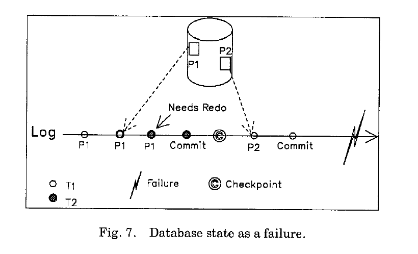

**5.NORMAL PROCESSIONG 正常处理**  
本章节讨论了在正常事务流程是如何执行的，第六章讨论了在系统恢复是如何处理的。  
**5.1Updates 更新**  
在正常处理时，事务可能处于，前进处理(forward processing),部分回滚，完全回滚。回滚可能是由系统或者应用启动的。导致回滚的原因可能是死锁，错误，完整性约束，非正常的数据库状态等等。  
如果锁的颗粒度是记录级的，那么当对一个页上的记录进行更新时，这个页会被钉在缓存中，并加上X闩，接着执行更新操作，追加一条日志，该日志的LSN会记录到该页的page_LSN字段（同时记录到事务表中），最后该页会被解锁并解除锁定。在写日志的时候页是一直锁定的。这么做是为了保证对于该页的日志顺序和该页的更新顺序是一致的。这么做是很重要的，一些redo信息是物理记录的（比如，某页的空闲空间），当历史重演的时候，需要保证物理redo可以正确的执行。在读取和更新页内容的时候，页也必需一直被锁住。这也是必需的，因为在对页进行垃圾回收的时候，可能会移动记录的位置。当这种垃圾回收机制运行的时候，其他事务不可以操作该页，所以，它们(事务)的访问可能会被拒绝。读取页加S闩，修改页加X闩。  
对索引操作时，无需对数据页加锁。一个页上最多可同时加两个页闩（参见【57,62】）。这意味着两个事务T1，T2可以以(T1,T2)的顺序来修改某页的不同部分，然后在以另一种顺序(T2,T1)的顺序来修改某索引页。这种场景在System R和SQL/DS系统中是无法实现的，这些系统使用锁而不是闩来保证物理一致性。典型的不同是：所有的（物理）页锁都是在RSS（数据管理）调用的最后才会被释放。一个RSS调用处理数据修改和相关的索引修改。这可能会触发很多IO等待和锁等待。这意味着死锁发生在单独（物理）页锁或者（物理）页锁和（逻辑）记录/key锁之间是有可能的。这对于System R和SQL/DS是一个大问题。  

图7描述了一种场景：当两个事务在提交的时候，系统崩溃了。The dotted lines show how up to date the states of pages PI and P2 are on nonvolatile storage with respect to logged updates of those pages.在重启恢复时，必须意识到，P1最近的一次写的日志记录（事务之后提交后）需要被redo，对于P2来说不需要redo。这种场景表明了使用LSN关联物理存储中的页状态和日志中的特定位置的必要性，同样，在checkpoint中需要记录一些信息来标识重启redo应该从何处开始(参见5.4节)。对于样例中的情景，重启时redo日志扫描至少要从T2的P1的最近一次更新日志开始，因为这些更新需要被redo.  
这并不是假定一条单独的日志记录就可以提供所有关于此更新操作的redo和undo所需的信息。有时候，可能需要写好几条记录。比如，一条记录用来记录undo信息，另一条用来记录redo信息。在这种情况下：
(1)undo-only日志需要写在redo-only日志前面。
(2)redo-only日志记录中的LSN应该记录在该页的page_LSN中。
