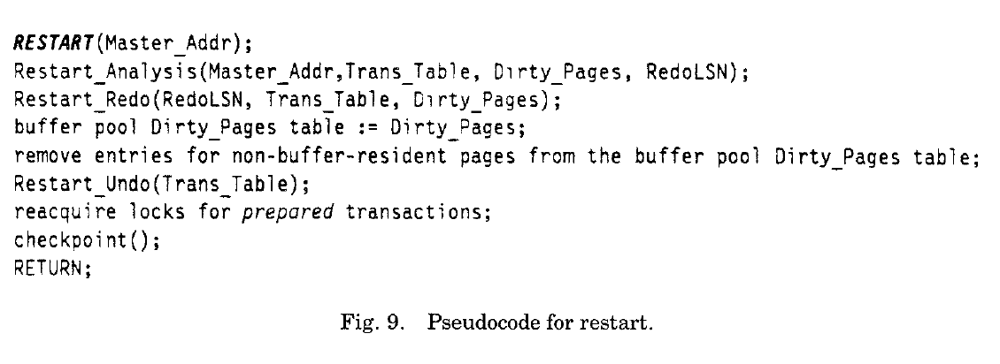
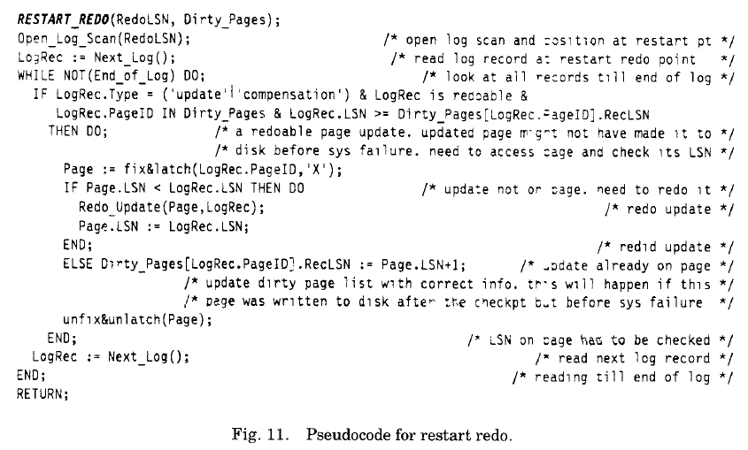
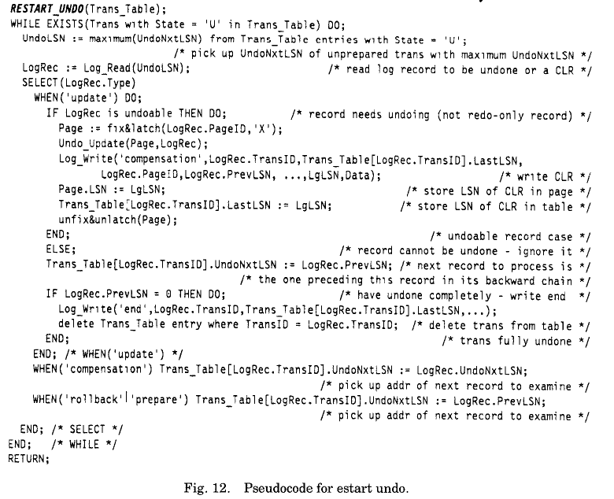

**6.RESTART PROCESSIONG重启流程**  
当事务型系统崩溃后重启，恢复策略需要保证数据的一致性和事务的原子性和持久性。图9描述了在系统重启恢复时起始调用的RESTART例程。该例程的的输入是master record的LSN,它包含了系统奔溃前的最后一次完整checkpoint的begin_chkpt记录的指针。该例程顺序触发分析遍历，redo遍历和undo遍历。缓存池的脏页表也会恰当的进行更新。在恢复结束后，会执行一次checkpoint.  
考虑到高可用性，重启流程的耗时必须尽可能的短。达到此目标的一种方法就是并行进行redo遍历和undo遍历。只有当使用并发遍历的时候，才需要在修改页数据的时候加闩。最理想的情况就是在重启恢复过程中，仍然允许执行新事务，参见[60]。 
  
**6.1Analysis Pass 分析遍历**  
重启恢复流程中第一次遍历就analysis pass。图10描述RESTART_ANALYSIS例程是如何执行这些遍历动作的。该例程的输入是master记录的LSN。输出是一个包含处于in-doubt或unprepared态的事务列表，一个包含可能是脏页的列表，和RedoLSN（标识redo遍历需要从哪边开始处理日志）。该例程唯一会写的日志记录就是事务的end记录（在系统崩溃前事务已经完全回滚，但是丢失了end记录）。  
在遍历过程中，如果一条日志记录所对应的页并不在脏页表中，那么就会在表中生成一个实例并用当前记录的LSN作为其也的RecLSN。同时通过修改事务表跟踪这些事务的状态变更，并且记录最近一次日志的LSN以便在确定这个事务需要回滚的后做undo。如果遇到OSfile_return日志记录，该文件中的页如果在脏页表中，那么就会被移除，以确保在redo遍历的时候不会访问到该文件的这个版本的页。一旦导致文件删除的原始操作提交了，相同的文件会在随后被重写创建和更新。在这种情况下，重建的文件中的页会出现在脏页表中，它们的RecLSN值会比文件删除时的日志结尾的LSN要大。在分析遍历结束后，RedoLSN为脏页表中的最小的RecLSN值。如果脏页表为空，那么就可以跳过redo遍历。  
其实并不需要独立做一次分析遍历，在0S/2 Extended Edition Database Manager实现的ARIES中就没有分析遍历。这很特殊，因为正如我们之前提到的（参见6.2节），在redo遍历时，ARIES无条件的redo所有丢失的更新。也就是说，不管他们的记录的是失败的还是没有失败的事务，都会redo，这一点和System R,SQL/DS,DB2不同。因此，redo并不需要知道事务是否失败。这个信息严格的来说对undo遍历有用。对于某些系统可能并不适用（比如DB2），它在in-doubt态的事务获取的锁，来自于进行redo遍历时从in-doubt事务日志记录中的锁。这种获取锁的方式使得对RedoLSN的计算就要考虑到in-doubt态的事务的Begin_LSN，继而我们就得在redo遍历之前知道各个in-doubt事务的标识。  
除了分析遍历外，事务表可以通过checkpoit记录和redo遍历时遇到的日志记录来构建。RedoLSN就是min(min(end_chkpt记录中的脏页表的RecLSN),LSN(begin_chkpt记录))。不使用分析遍历，就需要使用其他方法来避免更新那些已经归还给操作系统的文件。另一个结论是，在redo遍历中的脏页表不能用来过滤begin_chkpt记录之后的操作日志记录。  
**6.2 Redo遍历**  
在重启恢复的第二道遍历是redo遍历。图11描述了RESTART_REDO例程是如何实现遍历的。这个例程的输入是RedoLSN和restart_分析例程提供的脏页表。该例程不会输出任何日志记录。redo遍历从RedoLSN开始扫描日志记录。如果遇到一个可redo的日志，会检测该页是否在脏页表中。如果在，并且该记录的LSN大于等于脏页表中该页的RecLSN，那么该条日志就可能需要redo.为了进一步确认，会访问该页，如果该页的LSN小于记录的LSN,那么就需要更新该日志。这样，RecLSN信息就限制了需要检查的页的数量。该例程重建了系统崩溃时刻的数据库状态。甚至那些丢失的事务的更新也被redo了。在历史重演背后的基本原理会在10.1节详细解释。这就意味着，有些丢失的事务的redo日志是不需要的。在【69】中，我们会讨论一种限制历史重演的方案，从而可能减少在本次遍历中被认为是脏页的数量。  
  
由于redo是面向页的，在redo遍历的时候只有在脏页表中的页才可能被修改。只有脏页表中的页才会被读取和校验。不是所有读取的页都需要redo。这是因为有些页在最后一次checkpoint的时候是在脏页表中的，但是在系统崩溃前这些脏页已经刷到非易失存储上了。因为某些原因，比如减少日志大小，降低CPU负载，并不能期望系统会写日志标识已经刷到非易失存储上的脏页。尽管，这样做是可以的，并且这种日志记录可能减少在分析遍历的时候碰到在脏页表中的记录数。尽管，这些记录是在IO完成之后才会写，系统崩溃是在很短时间内发生，可能这些记录就没写出来。那么相应的页在本次遍历的时候就不会发生变更。  
为了简单起见，对于系统崩溃在事务完成日志记录和在执行该事务的追加动作之间，我们不会讨论在redo遍历时如何redo这些残留的追加动作。  
为了利用并行模型，脏页表中的信息可以使用异步IO来读取这些页，这样当redo遍历的时候遇到这些记录时，它们已经在缓存中了。Since updates performed during the redo pass are not logged, we can also perform sophisticated things like building in-memory queues of log records which potentially need to be reapplied (as dictated by the information in the dirty .pages table) on a per page or group of pages basis and, as the asynchronously initiated 1/0s complete and pages come into the buffer pool, processing the corresponding log record queues using multiple processes。这就要求每个队列只能由一个进程操作。对不同页的更新顺序可能和日志中记录的顺序不一样。这并不会丢失正确性，因为对于给定的页，所有丢失的更新都会与之前一致的顺序进行操作。这些并行的思想对于通过远程备份来进行灾难恢复同样适用。  
**6.3 Undo遍历**  
在重启恢复第三道遍历是undo遍历。图12描述了RESTART_UNDO例程是如何实现这些操作的。  

