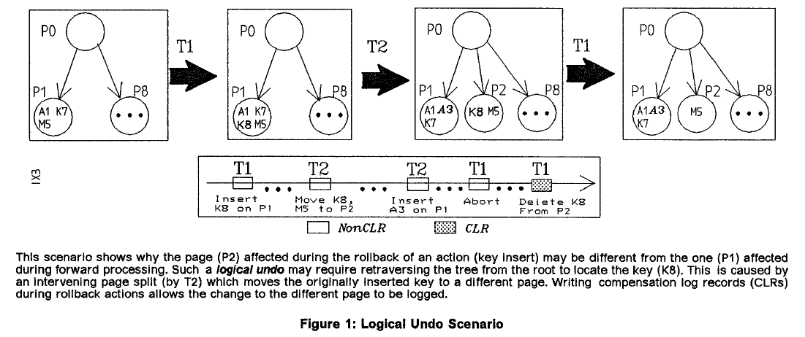
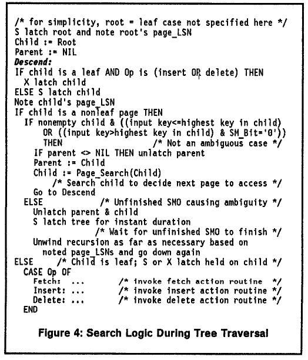
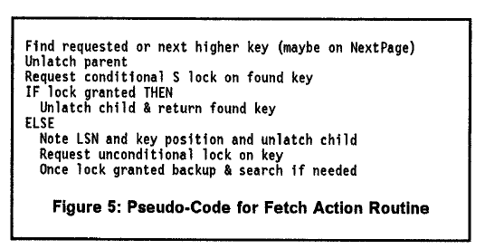
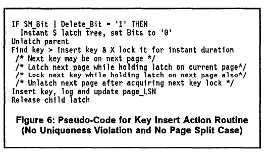
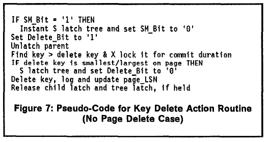
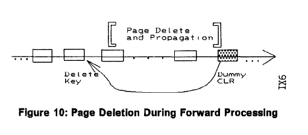

ARIES/IM:基于WAL的一种高效高并发的索引管理方法  
C. MOHAN
Data Base Technology Institute, IBM Almaden Research Center, San Jose, CA 95120, USA
wharr@alnwden, tbm. com
FRANK LEVINE
IBM, 11400 Burnet Road, Austin, TX 78758, USA  
摘要：本文提供了一种对于事务系统中索引管理的综合处理方案。这种方案叫做ARIES/IM(Algorlthm for Recovery and isolation Exploiting Semantics for Index Management),可以进行并发控制和B+树的恢复。ARIES/IM确保串行性并使用WAL来恢复。它支持高并发并且有性能优异：（1）将某个key上的锁视为数据页中相应记录的锁（比如在记录级别）  
（2）为了支持高并发，在提交时不获取索引页锁，即使这时候索引结构发生了变更（SMO）比如页分裂，页删除。  
（3）支持在遍历，插入，删除同时，进行SMO。  

在重启恢复时，对于索引变更的redo是以面向页的方式执行（比如，不需要遍历整个索引树），并且在正常执行和重启恢复时，不管有没有可能，undo都是以面向页的方式执行的。ARIES/IM使用多种级别的锁来保证灵活性。ARIES/IM的一个子集已经应用到0S/2 Extended Edition Database Manager。由于ARIES/IM的锁设计很通用，所以它们也被应用到SQL/DS和VM Shared File System，尽管这些系统使用影子页技术来恢复。  

**1、介绍**  
对B树及其变种的并发访问协议已经研究了好长时间(参见 [BaSc77, LeYa81, Mino84, Sagi86, ShGo88]及其它们所引用的一些文章）。这些论文中都没有考虑的如何保证事务的原子性和串行性，该事务包含了对B+树的多种操作（比如获取，插入，删除等）,当事务，系统，或者介质崩溃，并且被不同事务同时访问。[FuKa89]描述了一种错误的（比如：在not found的时候不完全锁，对于范围扫描时进行完全加锁）并且昂贵（使用嵌套事务）的方案来解决此类问题（详情参考[MoLe89]）。数据库管理系统（DBMS）比如[DB21,the 0S12 Extended Edition Database Managerl, System R,NonStop SQLt and SQUDS]的索引管理都支持串行化（重复读（RR）或者第三级别的一致性[Gray78]）。在恢复时，DB2, NonStop SQL 和  0S/2 Extended Edition Database Manager 使用日志先行（WAL）[Gray78,MHLPS92],而System R 和 SQL/DS使用影子页技术[GM BLL81]。不幸的是，上述系统所使用算法细节并没不公开。本文中，我们会描述一种并发控制及恢复策略，称为ARIES/IM（A/gorithm for Recovery and Isolation Exploiting Semantics forindex Management),来构建B+树索引。我们使用ARIES/IM作为0S/2 Extended Edition Database Manager设计的一部分。  

首先，System R如何对索引加锁的大部分细节已经在[Moha90a]中详细描述，并且作为我们ARIES/KVL的一部分，用来改进该方法的并行度和加锁开销特性。除了提供低颗粒度锁（通过数据的记录锁和索引的key值锁），System R系统（起源于IBM的SQL/DS产品）锁提供的并发级别，客户并不满意的。由于，ARIES/KVL是在key值上加锁而不是在单独的key上加锁，所以ARIES/KVL对于增强并发度仍然不够。后者在非唯一性索引上有重大改进。此外，在System R中，即使是对单条记录的插入或删除所要获取的锁数量也是相当多的。因此在设计ARIES/IM是，我们的首要目标是修改System R算法，使其使用WAL，并且彻底提升了它的并发度，性能和功能特性。需要通过高效的恢复和存储以及高并发来支持串行执行。ARIES/IM可以满足所有这些要求。  
ARIES/IM是基于ARIES的恢复和并行控制策略，这在[MH LPS92]中有介绍，并且在众多产品中不同程度的实现了它，比如：IBM的产品0S/2 Extended Edition Database Manager,Workstation Data Save FacilityA/M 和 DB2 V2,IBM的研究原型系统Starburst 和 QuickSilver，以及Transarc的Encinai产品套装，Wisconsin大学的 Gamma data base machine 和 EXODUS 可扩展DBMS。在ARIES/IM中，以极少的锁提供了高度的并发性。通过高效的执行undo和redo以及在undo时避免死锁，来提升重启恢复和正常执行时的性能。我们的并发度测量在[KuPa79]中有明确的定义，它陈述：一系列事务运行相交的事务越多，它们的并行度越高。我们的性能测量就是所需要获取的锁数量，在redo,undo过程中访问的页数量，以及正常操作数，在介质恢复时所需要遍历日志的次数，所需要同步的数据页数，以及日志IO。  

  

本文剩余的部分如下组织。本节接下来，我们首先介绍树的结构，并列出在索引并发控制和恢复中的一些问题。由于ARIES/IM是基于ARIES的，我们会介绍ARIES的恢复和并发控制策略。接着第二节会描述ARIES/IM的并发控制特性，第三节讨论恢复方面。第四节，我们会解释如何去避免死锁以及为何回滚事务不会触发死锁。在第五节，我们做一个总结，并讨论ARIES/IM的实现。  

**1.1. Tree Architecture and Problems**  
一个叶子页中的key就是一组key值和record-id，record-id(RID)就是包含了这个key值的记录的标识。记录是存储在数据页中（在索引树之外）。叶子页是单独的前后串连的。每一个非叶子页都包含了一定数量的子页指针和少量的high key--每个high key都和一个子页指针关联，最右的子页就没有high key和它关联。对于某个子页，存储在非叶子页中的high key通常比存储那个子页中的最大的high key要大。  

ARIES/IM支持4中基本的索引操作：  
(1)Fetch获取：对于某个key值或者部分key值（比如前缀），检查其是否在索引中，并且取出完整的key。同样可以使用起始条件（=，>,>=）。  
(2)Fetch Next获取下一个：使用Fetch调用打开一个范围遍历，获取下一个满足条件范围的key（比如，终结key或者比较操作符（<,=,<=））。  
(3)Insert 插入：插入某个key(key-value,RID)。对于唯一性索引，会首先调用search逻辑来避免key重复。对于非唯一性索引，这个新key会作为search的输入。  
(4)Delete 删除：删除指定的key。  

在对索引树进行恢复和并发修改时有很多问题，一些接下来会被解答的问题是：  
（1）如何日志记录索引的变更，这样在系统崩溃后进行恢复时，丢失的更新都能快速的重新应用上？  
（2）如何确保，如果一个SMO(structure modification operation,比如，页分裂，或者页删除操作)正在执行，此时系统崩溃了，该SMO的一部分操作影响已经记录到数据库的磁盘上，那么系统可以将索引树恢复到系统奔溃时刻的结构，并保证其一致性（参见图11，该情形会导致树结构的不一致）。  
（3）怎样对索引页执行变更，才能最小程度的减少对其他访问者的影响。  
（4）如何确保即使某个事务在成功提交了一次SMO后回滚了，它不会undo这个SMO，因为这么做会导致丢失其他事务的一些更新操作（其他事务在此期间对于这个SMO涉及的页进行的操作）  
（5）如何检测事务T1原来插入到页P1的key已经被移到了P2上（因为事务T2的SMO操作），这样，如果T1回滚了，然后访问到了P1，发现P1上的key已经被删了。（参见图1中的逻辑undo的例子）  
（6）如何检测如果事务T1从P1删除的key，由于其他事务的SMO操作，该key又处于P2上，这样当T1回滚的时候，就会访问到P2上，但是key就会已存在。  
（7）如何避免回滚事务的死锁，这样对于回滚事务的时候就不需要特别的流程来避免死锁。  
（8）如何支持多种颗粒度级别锁，选择什么作为锁对象。  
（9）如何锁住“not found”状态来确保RR（比如，处理幻读问题。）  
（10）如何保证在唯一性索引上，如果一个事务删除了一个key值，在这个事务提交前，其他事务不可以使用该key值。  
（11）如何使的树的遍历能够持续进行，即使正在执行SMO，并且能够确保该遍历的事务可以恢复，(这些事务涉及到了SMO影响的页)参见图3，描述了该场景。  

**1.2ARIES**  
在本一小节中，我们会简略的介绍一下ARIES恢复策略。读者可以参考[MHLPS92]，其中有对ARIES的详细描述，[MoPi91]对ARIES的实现方法做了一些优化，[MoNa91]正对ARIES在共享磁盘环境下做了增强，[RoM089]描述了ARIES/NT,这是对嵌套事务模型的ARIES的扩展。我们假设读者对以下概念已经有所了解：latch，不同级别的一致性（重复读，游标稳定性），不同阶段（tnstant,提交）以及不同的latch,锁模型，这些在[Gray78, MHLPS92, Moha90a, Moha90b]中有详细描述。  

在ARIES中，每个数据页都有一个page_LSN字段包含日志记录的LSN，用它来描述最近一次对页做的更新。由于LSN随着时间递增，通过比较恢复时刻的page_LSN和日志记录的LSN，我们就可以确定该条日志是否已经在该页上生效。也就是说，如果page_LSN比日志记录的LSN小，那么后者就还没有在该数据页上生效。ARIES在页上使用latch来保证相关信息的物理一致性，在数据上用锁来保证逻辑一致性。ARIES支持低颗粒度锁（比如记录锁），以及富语义的锁模型（比如，自增/自减锁），部分回滚，嵌套事务，日志先行，选择和延迟重启，模糊进行备份（日志归档），介质恢复，强制和非强制缓存管理策略。  

在ARIES中，系统崩溃后重启恢复包含三次日志遍历：analysis,redo,undo。第一次日志扫描，从上一次完成的checkpoint开始到日志结束。analysis遍历决定下一次日志扫描的起始点。它同样会提供in-flight和in-doubt状态的事务列表。在redo遍历时，ARIES使用日志重演来redo那些磁盘上的日志更新（这些更新之前已经更新到数据页上但是没有落地到磁盘中）。对于所有事务都这么处理，包括那些in-flight的事务。redo遍历同样会获取一些锁来保护那些in-doubt事务中未提交的更新。  

接下来的遍历是undo遍历，这时所有in-flight的事务的更新都会回滚（在单一日志文件范围内，以逆序方式回滚）。除了在事务正常执行时记录日志，ARIES同样也会记录（通常使用补偿日志，CLR）那些在部分或者回滚事务中的更新操作。CLR有一个属性：他们都是redo-only日志。通过将CLR和正常执行的日志记录串连起来，回滚所需的日志量就固定了（即使在重启恢复时重复崩溃或者嵌套回滚）。当对一条日志（nonCLR）进行undo时，会生成一条CLR，（通过CLR的UndoNxtLSN字段）该CLR会指向这条undo日志的前继。  

有时候我们希望事务中的一些更新肯定要被提交，不管该事务有没有提交。我们仍需要这些操作的原子性。对于某些情况下很实用：本文接下来会提到的索引页的分裂和删除，以及在hash存储模型中的记录重定向[Moha92]。ARIES通过内嵌顶级动作来支持这一特性。预期的效果是在内嵌顶级动作结束时生成虚拟CLR（参见图9）。虚拟CLR的UndoNxtLSN记录了开始内嵌顶级动作前一条日志记录，如果事务在完成内嵌顶级动作之后准备回滚。ARIES的历史重演特性保证了内嵌顶级动作可以redo，如果有需要的话，在系统崩溃后，即使他们已经在in-flight事务中生效了。如果系统在生成虚拟CLR之前崩溃，那么这个不完整的内嵌顶级动作就会被undo，通过记录在undo-redo(对应于redo-only)日志记录中内嵌顶级动作的日志来undo。这提供了内嵌顶级动作本身的原子属性。  

**2.Concurrency Control in ARIES/IM**  
本节中，我们会描述ARIES/IM一些特性，用在并行控制方面的。首先我们会给出一个大体上的概述，然后在详细论述不同索引操作下的特性。ARIES/IM的这些特性是为了能在恢复时正确执行（在第三节有描述）。系统恢复会要求在并行执行一些特定操作时添加一些限制。详细请参考[MoLe89].  

**2.1. Overview oJLocking and Latching**  
如图2所示，总结了不同操作下所需要的锁。  
  

ARIES/IM支持高度的并发以及良好的性能：    
（1）将某个key上的锁视为数据页中相应记录的锁（比如在记录级别）  
（2）为了支持高并发，在提交时不获取索引页锁，即使这时候索引结构发生了变更（SMO）比如页分裂，页删除。  
（3）支持在遍历，插入，删除同时，进行SMO。  

ARIES/IM通过锁住一条记录来锁住key(这条记录的record id在这个key中，或者数据页ID--record id的一部分，如果锁颗粒度是页级别的)。一个锁如果真的锁住包含这个key的数据块，我们称这个锁为data-only锁。相对应的就是key-value锁，用在System R和ARIES/KVL[Moha90a]中，以及索引页锁，用在DB2和System R(使用页锁)。我们称之为index-specific锁。实际上，ARIES/IM很容易改造成是用index-specific锁，现对于data-only锁并发度更高，但是会带来额外的锁开销（参见[MoLe89]）。若使用data-only锁，在删除和插入key时，当前的key不会被索引管理组件显示锁住，因为记录管理组件可能已经锁住相应的记录（在数据页操作阶段使用提交段的X锁）。只有在是用index-specific锁时，索引管理组件才会对删除和插入key加显示锁。因为在使用data-only锁是，在调用fetch和fetch next时，索引组件锁住当前key，遍历该数据页中的下一条记录，就不需要锁住相应的记录。显然，如果使用index-specific锁，记录组件就需要锁住相应的记录了。  

  

在插入或删除key时，会锁住索引的下一个key来这次RR(这样就解决了幻读问题)，并且这样也能保证在唯一性索引中，不会出现多个key有相同的key值的情况（因为事务回滚的原因，参见2.4小节insert和2.5小节delete）。同样在fetch或者fetch next操作，为了保证RR，如果当前的key不是想要的key，也会锁住下一个key（参见2.2节Fetch和2.3节Fetch Next）.  

Latching。当遍历索引树来执行各种操作时，只使用页latch来保证信息的物理一致性。这减少了需要获取锁的数量，并且提高了并发的性能。在任意时刻只会latch一个索引页。为了提高并发度，并且避免latch的死锁，即使还没有获取到latch，因为要等待获取锁（锁并不是刻意立刻获取到的）。在索引访问的时候，不需要获取数据页latch 。当遍历索引树时会用到latch coupling--比如，latch住了父页，再请求子页的latch。所以遍历索引树的步骤如下：  
（1）S latch住根节点，并当它为当前页。  
（2）检测当前页，判断子页是否已经被latch住，然后是子页为当前页。如果当前页不是叶子节点，S latch住它，unlatch其父节点，重复步骤2。如果当前页是叶子节点，X(或者S) latch住它，如果对key的操作是insert/delete（或者fetch/fetch next）   
接着，会对上述逻辑添加一些校验来预防一些其他事务的并行操作导致的问题（SMO等等）。  

Structure Modification Operations。如果需要SMO（页分裂或删除），会由同一个事务执行它，这和其他方法里不同[Sagi86, ShGo88]。当一个事务分裂了某页，在它提交这个分裂动作之前，其他事务就可以读这个页，甚至修改这个页。为了提高并行度，SMO的影响是在树中以自底向上传播。（比如，从叶子节点到非叶子节点），除了安全节点（页）（参见[BaSc77]）。为了避免latch的死锁，低级别的页的latch会在高级别的页被latch和修改之前释放。这个叶子页可能会使得遍历者访问前后不一致的树（参见图3）。对于该设计的基本原理会在[MoLe89]中有详细论述。Splits are done to the “right”。也就是说，相对大的key值会被移动到新页上。变成空页的的页会从树中移除掉。这就保证了，在SMO都结束后，索引中还有空页的情况（SM_Bit(参见下面)为0，这样该页就可以从索引页的根部进行访问）。为了避免某个事务的SMO和其他事务的一些操作有交叉（参见图3），ARIES/IM会这么处理：对于一个索引树上的SMO会串行执行，通过对这个索引树加X latch。  

某个事务在对叶子级别执行SMO时会获取索引树的X latch，并且一直持有到SMO的影响在索引树中传播完毕。由于SMO是在叶子级别执行，并传播到整个树中，在每个页中会有一个bit,称之为SM_Bit，会被设置成‘1’,用来提醒其他事务正在执行SMO。使用SM_Bit来避免一些问题：比如因为执行未完全的SMO，而插入了错误的页。只有当SMO执行完毕后，SM_Bit就会重置为‘0’。  

为了支持高并发，在进行索引树遍历时，并不会获取树latch。但是在某些情况下，ARIES/IM会使用树latch来确保同步。比如不同的事务正在进行插入和删除key，同时这个树上正在执行SMO。当某个页正处于SMO未完成态时（比如该页的SM_Bit-‘1’），在遍历树时就要获取树latch。并且  
（1）如果这个页不是叶子节点，关于是否继续遍历子树还不确定。  
（2）这个页是叶子节点，并且需要修改。  
在这些情况下，就需要获取这个树的S latch来等待SMO结束（参见图4，图6，图7）。因为ARIES/IM是自底向上传播SMO，只有同时latch住父节点和子节点，并且子节点的SM_Bit为0时，父节点的high key才可用。也就是说这条父-子路径才是有效的。 

接下来，我们会讨论在访问到叶子节点后的一些操作（Fetch，Insert。。。）  
  

**2.2. Fetch**  
图5描述了Fetch的逻辑，如果Fetch到了最后一个（比如最右边）叶子页，并且没有匹配的或者更高的key值，那么它就会认为到了EOF（End of File）.索引会使用一个特殊的锁名作为找个的这个key的锁名。如果没有找到需要的key值，但是有更高的key值或者处于EOF状态，那么就会返回给调用者“not found”。如果在遍历树时，检测的第一个叶子节点没有等于或者大于要搜寻的key，那么下一个叶子节点就会latch住并访问，同时也会继续持有第一个页的latch，用来寻找下一个更大的key（详情参见[MoLe89]）。无论如何，当持有页的latch时，对找到的key上要加S 锁。在获取锁的同时持有latch确保了相应的信息（比如，相应的key是不是真的存在）是正确的（比如：这个状态应该是提交态的，当然同一事务内该状态是未提交的）  
   
为了缩短本篇文章的篇幅，所有的加锁操作都会立刻完成（比如，有些时候需要获取树 和/或者 页的latch）.为了避免死锁以及提高并发度，如果有条件的锁没有立刻获取到，那么就需要采取以下的步骤：  
（1）所有的latch都必须被释放。  
（2）必须无条件的获取锁。  
（3）一旦锁获取到了，必须执行一次验证来确保本次操作的正确性（比如：请求另一个锁），如果还没持有latch时（比如：加锁的key不存在了，或者更小的key出现在索引中了），变更了需要加的锁。在unlatch这些页之前，他们的page_LSN会被记录下来用来检测是否有发生了变更。在获取其他latch时，也不应该无条件的获取树latch。至于锁，如果在不持有页latch时获取树latch，那么对于之前的信息必须执行一次校验（这可能需要重新检验该子节点的父节点）  

即使，没有找到待搜索的key，也会锁住当前索引中的下一条high key，用来确保待搜索的key在本事务结束前不会出现了（可能会被其他事务插入），从而防止了可能的RR。我们接下来就会看到，在插入key时，连同下一个key一起锁住，从而使其能确保RR和串行性。在Fetch时锁住同样可以确保搜寻的key不会被其他未提交的事务删除。接下来我们会看到，对某个key删除时会在提交阶段对下一个key加x锁。 
 
**2.3. Fetch Next**  
如果当前游标的位置满足了停止key的条件（唯一性索引和=的停止条件），那么Fetch next会立刻返回给调用者“not found”。否则，可能包含key的叶子页（当前游标所指向的）会被latch住，然后检测它的LSN和上次记录的LSN是否不同。当前key（当前游标位置）可能不在索引中，因为同一事物可能在之前就把该key删了。如果发现发生了改变，那么就会重定向到下一个（key-value，RID)作为Fetch调用的返回。除了上述提到的情况，一旦下一个key被锁住了，它也要被锁住。如果下一个key满足key的范围条件，那么它就会返回，否则就会返回“not found”给调用者。  

**2.4. Insert**  
如果在叶子页上有足够的空间，那么在搜索到该页后，会在相同的key值插入，或者更高的key值出，或者跳过该页最后一个key值。如果插入定位到唯一索引的相同的key值处，那么它会获取S锁来确认该key值是否在提交态，当然如果是同一事务的话就是非提交态。获取到锁之后，如果发现之前找到的key仍然在索引中，就会返回“违反唯一性key”的错误给调用者。在提交阶段获取锁是为了确保该错误状态是可重入的。  
  
在其他情况下（参见图6），insert会要求在下一个key加瞬时x锁。这可能会导致在fetch的时候需要访问下一个叶子页来获取下一个key。在这种情况下，在获取锁的时候，这两个页都要加latch.加瞬时锁的目的之一是为了确定在对下一个key值加锁时，（此时需要在叶子上加x Latch,因此是在instant阶段锁而不是提交阶段锁）是否有其他并行的事务正在查找并且还没搜寻到这个插入的key。这样就解决了幻读问题，并确保了RR。在唯一性索引情况下，对下一个key加锁，insert可以确认当前是否有其他事务在对这个key有未提交的删除操作。  

在对下一个key加锁后，insert在对应的叶子页中插入数据库，unlatch这些页，并返还给用户成功标识。latch是用来确保instant 锁是获取到了正确的下一个key.如果当前没有足够的空间给insert，那么会对页执行分裂算法（参见图8）。只有在所有影响的页都放进缓存池中，才会获取树latch。这么做是为了将X树latch所带来的串行化延迟降到最低。在插入前，这次页分裂的影响会完全传播到整个树中。对于插入的这个延迟的原因会在第三节ARIES/IM中详细讨论。  

**2.5. Delete**  
删除的逻辑如图7所示。在查找到这个叶子页后，Delete会定位到要删除的key。会对下一个key获取提交阶段的X锁。这个锁的目的是为了提醒其他事务（正在插入这个key或者遍历这个key）当前这个未提交的删除。如果待删除的key是这个页中最小或者最大的key，会需要获取这个树的条件S latch。获取该latch的原因是：待删除的key是一个边界key，会关系到恢复阶段。（参见第三节ARIES/IM中的恢复）  
  
当成功获取锁后，delete会删除该key，unlatch页，然后返回调用者。但是，如果删除的key是该页中唯一的key，删除后该页就变成空页了。delete就会调用页删除逻辑（参见图8）。这个流程和页分裂流程类似，在确定所有的页都在缓存池之后会请求该树的X latch，从而减少持有x latch的时间。在持有latch期间，删除该key,然后执行页删除相关流程（修改相邻页的指针，传播该页删除等等）  
  

**2.6. Discussion**  
在本小节中，我们会解释在不同的叶级别的操作在锁方面的不同。insert和delete对next key加锁阶段的不对称性（instant vs commit）是由于未提交的insert是可见的，key一旦插入就存于索引了，然而，key一旦删除就不可见了。所以，一旦key处于未提交的删除态，我们就要对还存在的key加上锁告诉其他事务这边有一个未提交的删除（比如，在获取锁上的冲突）。The lock has to be strong enough to prevent others from building a wall behind the tripping point such that the wail hides the tripping point from the point of deletion。构建这样一堵墙，使得其他事务得知该key并不存在，但实际上该key仍然处于未提交的删除态，并且该删除可以随时回滚。在插入时，新插入的key作为一个跳跃点，然后对删除而言，跳跃点得是一个稳定的节点（不会被其他事务删除）。读者现在应该意识到是怎么一回事了，[Moha90a]中有很多关于此的例子的讨论。  
 
**3. Recovery in ARIES/IM**  
恢复的逻辑和ARIES中类似，我们已经在1.2小节中简要说明了。在本节中，我们着重讨论对索引组件的恢复。我们会阐述在之前小节中提到的并行控制策略会受到恢复策略的影响。有一些问题需要认真考虑和分析，并找出解决方案。  

ARIES/IM中的日志：索引的所有变更，包含更新的undo，都记录到日志中，并且包含影响的页标识和增删的key。在Undo时执行的变更通常使用CLR来记录。在重启时，redo都以面向页方式执行。在System R中，索引变更不记录日志。因此在重启恢复时，undo和redo都是逻辑执行的，基于数据页的日志记录。为了能正确工作，该方法关键在与影子页恢复技术。  

Structure Modification Operations：即使一个执行过SMO的事务回滚了，如果在回滚之前SMO的影响已经传播到整个树了，那么之前的SMO在面向页模式中就不会被undo，从而避免擦除掉后续其他事务所做的更新（作用于这个SMO上的更新）。通过以下步骤来实现它：  
（1）SMO以内嵌顶级动作来执行。  
（2）如果插入操作需要页分裂，那么涉及到此次分裂的所有动作（叶子级别的动作，树内传播，以及写dummy CLR）都会在插入之前完成。（参见图8和图9）  
  
（3）如果删除某个key会导致页删除（因为变成了空页），那么会首先执行key删除，然后完成所有涉及到页删除的动作。dummy CLR会执行那个key的删除日志记录（参见图8和图10）  
  
这样，通过dummy CLR，如果该事务在执行完SMO后需要回滚，只要遍历和SMO相关的日志记录就可以了。与此同时，通过执行key的插入/删除导致SMO不在内嵌顶级动作，这保证了，在回滚是，增删导致的SMO也会被undo。为了保证索引树的一致性，部分完成的SMO也会被undo。这种undo是可接受的，因为在SMO开始后没有其他事务会修改这些页（通过SM_Bit和树latch）。在重启恢复的时候，不需要使用特殊的流程来判断索引是否一致。对这种索引没有特殊处理。如果由于进程崩溃，正常流程中SMO被undo了，那么在涉及到这个SMO的日志记录都被undo后，树latch就会被释放。  

在key的增删操作中，如果待修改的叶子节点的SM_Bit被设置为‘1’，这样，即使知道该页是否被影响了（比如图3中的，T2将要插入B值，而不是l），这次修改仍然会延迟，直到SMO已经完成了（比如，SM_Bit重置为‘0’）。这很重要的，因为，如果增删允许过早执行，那么这些事务就能提交了。之后如果因为系统崩溃，未完成的SMO会被undo.这个SMO的undo会导致这些叶子页的状态重置成SMO开始时的状态。这样就会擦除了那些已提交的事务的增删操作。  

